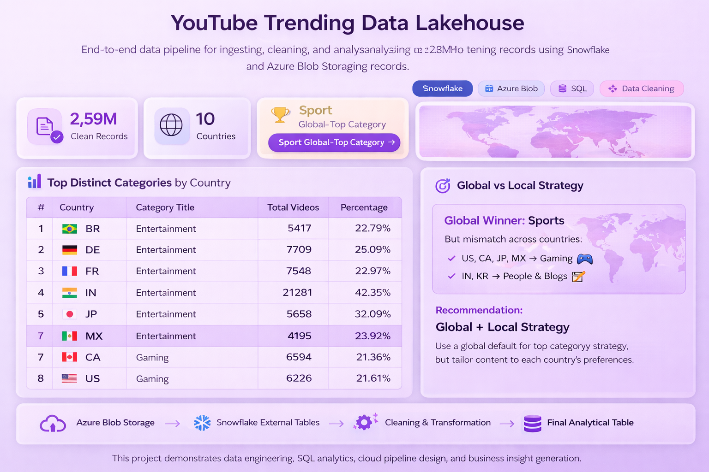

# 📊 YouTube Trending Data Lakehouse

## 🚀 Overview

This project builds an end-to-end **data lakehouse pipeline** to ingest, clean, and analyze **2.8M+ YouTube trending records** using Snowflake and Azure Blob Storage.

It demonstrates how raw data can be transformed into **actionable insights** through SQL analytics and interactive dashboards.

---

## 🧱 Tech Stack

* ❄️ Snowflake (Data Warehouse)
* ☁️ Azure Blob Storage (Data Lake)
* 🧮 SQL (Data Cleaning & Analytics)
* 🐍 Python (Streamlit Dashboard)
* 📊 Streamlit (Interactive Dashboard)

---

## ⚙️ Data Pipeline

Azure Blob Storage
→ Snowflake External Tables
→ Data Cleaning & Transformation
→ Final Analytical Table

---
## 📸 Dashboard Preview



---
## 🖥️ Interactive Dashboard

🔗 https://tracynguyen01-youtube-trending-data-lakehouse-app-apnbam.streamlit.app/

Run locally:

```bash
pip install -r requirements.txt
streamlit run app.py
```
---

## 📊 Key Insights

### 🌍 Global vs Local Strategy

* **Global winner:** Sports
* But user preferences vary across countries

**Local patterns:**

* 🎮 Gaming → US, CA, JP, MX
* ✍️ People & Blogs → IN, KR

👉 **Recommendation:**
Use a **Global + Local strategy**

* Global default: Sports
* Local override: adapt content per country

---

## 📈 Core Analysis

### 1. Top Distinct Categories by Country

Identifies dominant content category in each country.

### 2. Most Viewed Video per Country

Highlights viral content and engagement patterns.

### 3. Top Gaming Videos (Per Country)

Analyzes trending gaming content performance.

### 4. Category Distribution Across Countries

Reveals cross-market differences in audience behavior.

---

## 🧹 Data Quality Improvements

* Removed invalid video IDs
* Handled missing category values
* Removed duplicates using `ROW_NUMBER()`
* Final clean dataset: **2,597,494 rows**

---

## 📌 Project Highlights

* Built scalable cloud-based data pipeline
* Performed large-scale SQL analytics
* Generated business insights from 2.8M+ records
* Designed interactive dashboard for storytelling

---

## 💡 Future Improvements

* Deploy dashboard on Streamlit Cloud
* Add real-time data ingestion
* Enhance visualizations (charts, filters)

---

## 👤 Author

**Tracy Nguyen**
Sydney, Australia
